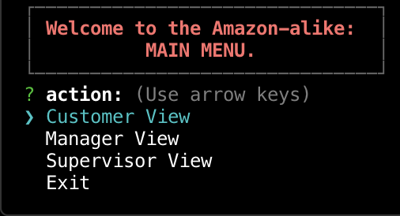
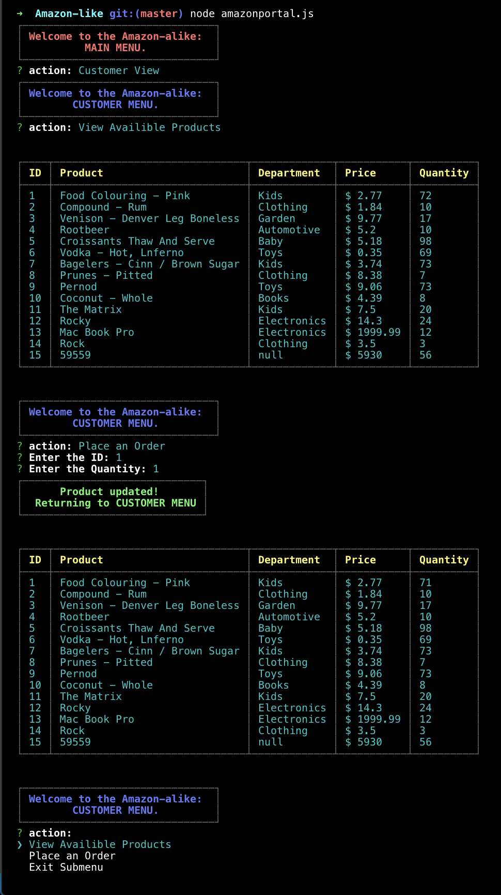
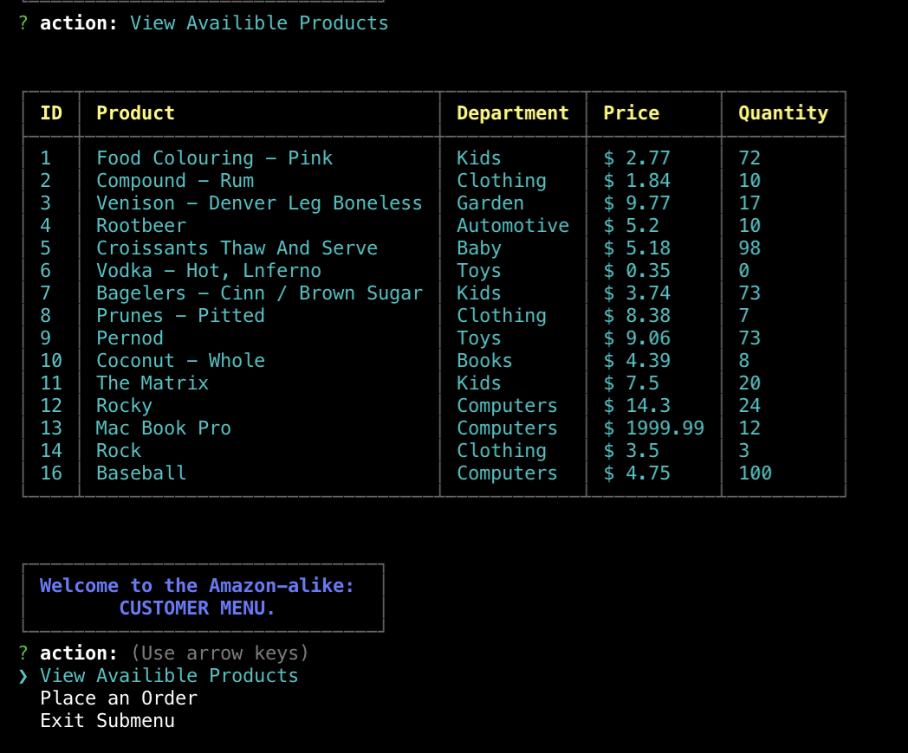
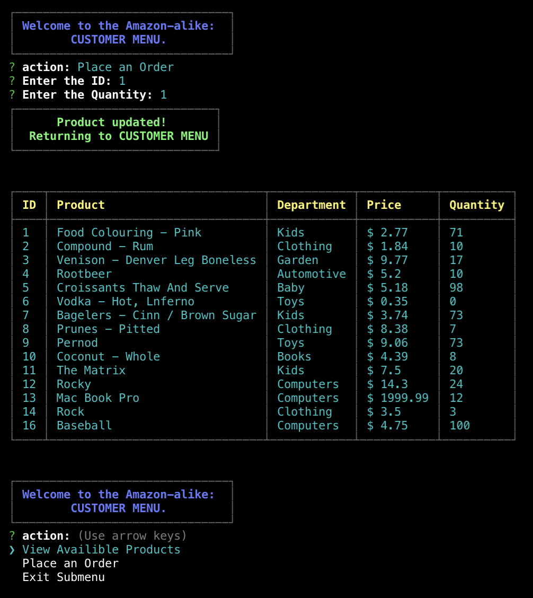
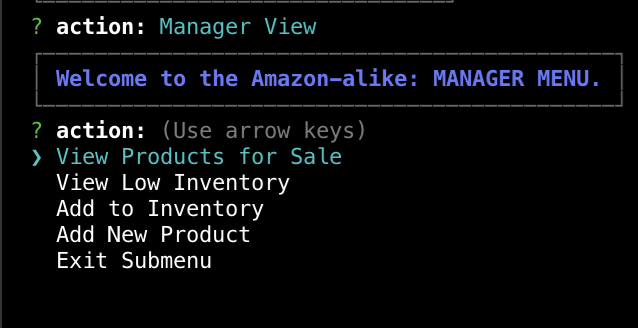
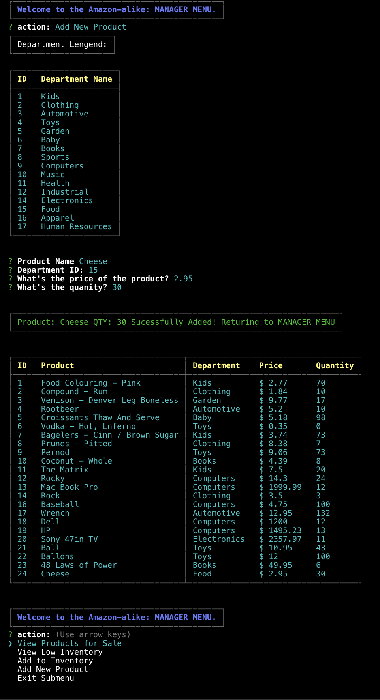
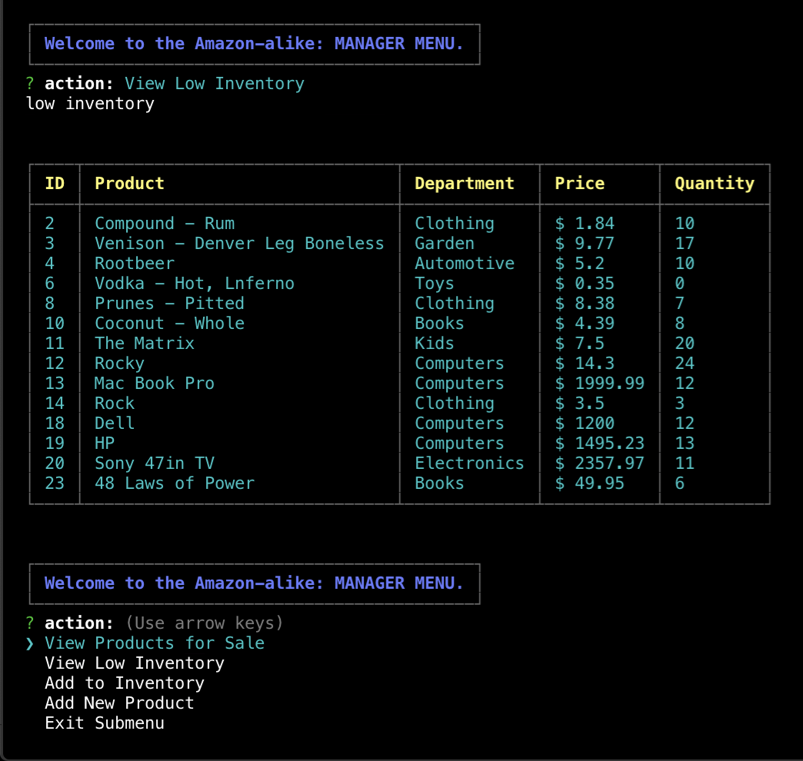
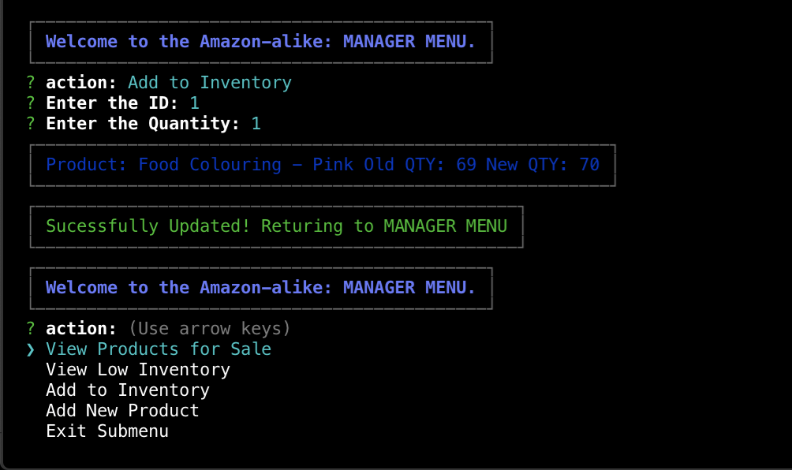
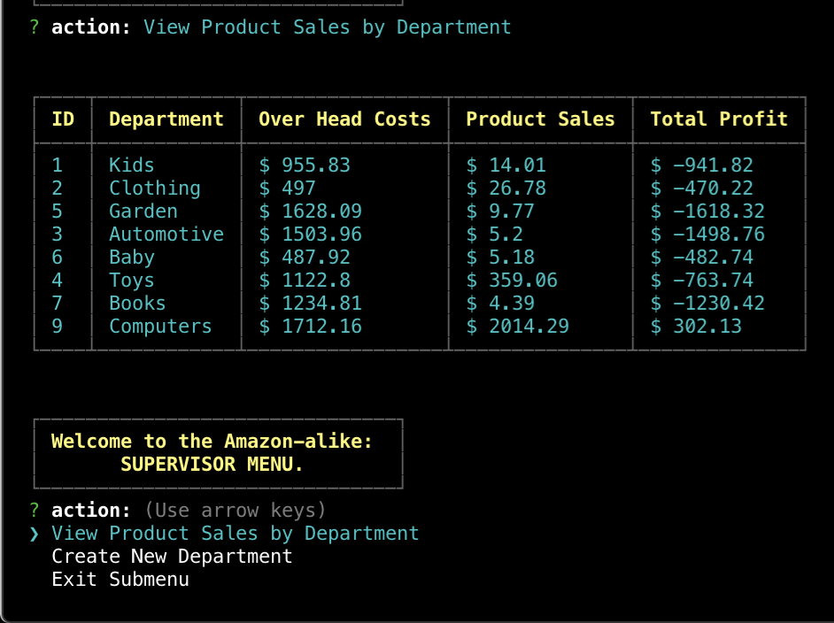

# Amazon-Alike

### Summary

Amazon-Alike is made to utilize MySQL, and node's inquirer package and take in orders from customers and deplete stock from the store's inventory. Amazon-Alike can also track product sales across the store's departments and then provide a summary of the highest-grossing departments in the store.

The start of the Amazon-Alike opens with three menu selections 

### Important before running

Before running the program, you need to install the packages.
Running `npm i` should do the trick! Then upload the SQL scripts and import the product_data.csv and department_data.csv provided to your local environment.
Enjoy!

### Customer View

### Manager View

### Supervisor View

## Bugs and feature requests
Have a bug or a feature request? [please open a new issue](https://github.com/cl33per/Amazon-Alike/issues/new)
  