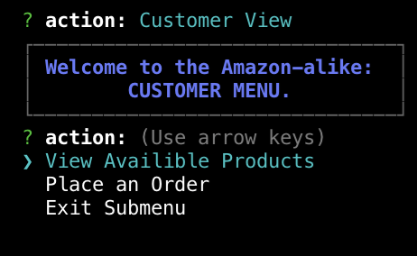
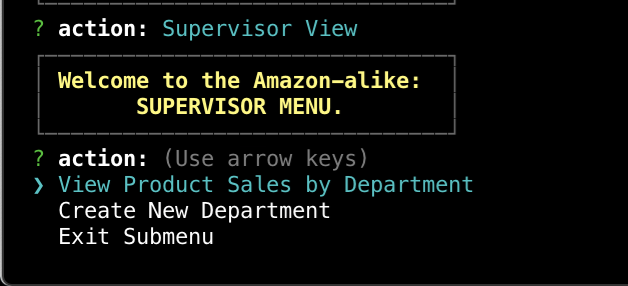
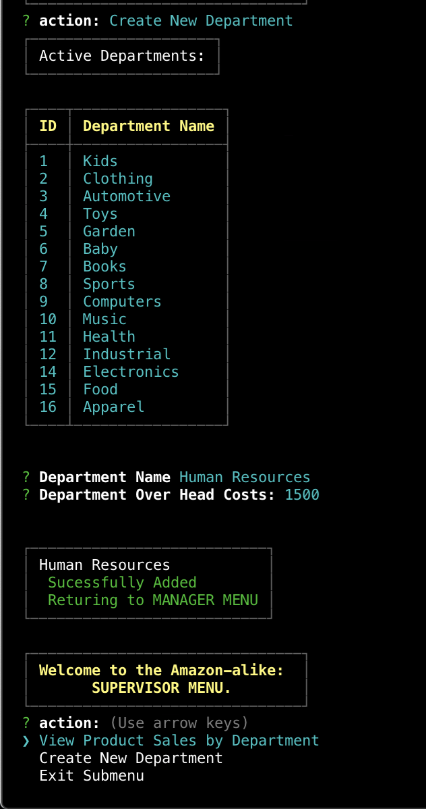

# Amazon-like

### Summary

Amazon-like is made to utilize MySQL, and node's inquirer package and take in orders from customers and deplete stock from the store's inventory. Amazaon-like can also track product sales across the store's departments and then provide a summary of the highest-grossing departments in the store.

The start of the Amazon-like opens with three menu selection 

### Packages Used 
mysql
pixl-cli
chalk
inquirer

### Importnat before running

Before running the program you need to install the packages. Specififcly mysql and inquirer. 
Running `npm i` should do the trick!
Then simply upload the sql scritps and import the product_data.csv and dfepartment_data.csv provided and can your own local enviorment

### Customer View

### Manager View

### Supervisor View

## Bugs and feature requests
Have a bug or a feature request? [please open a new issue](https://github.com/cl33per/Amazon-like/issues/new)
  